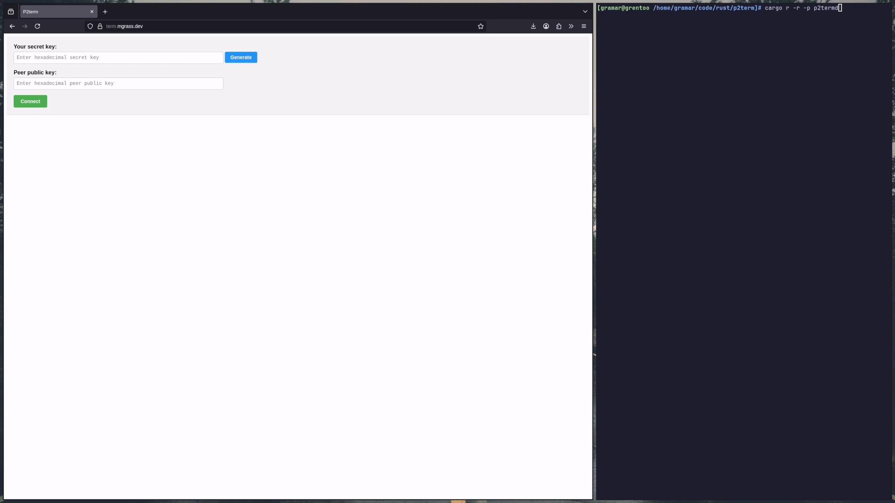
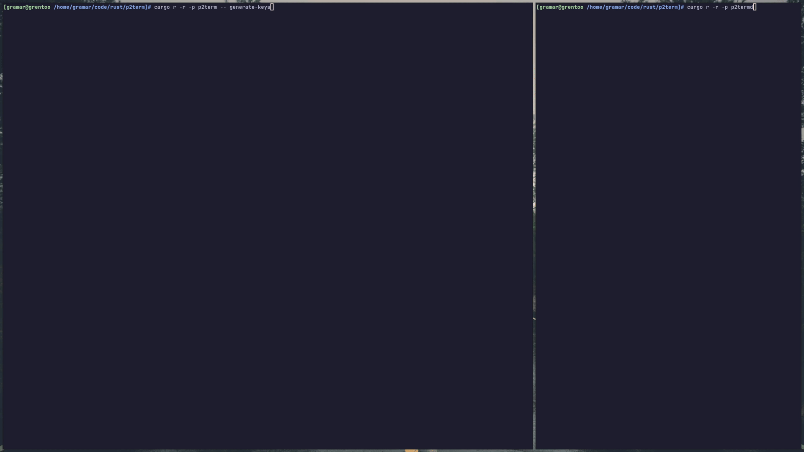

# P2term

A cross-platform peer-to-peer cli or web shell proxy, using [iroh](https://github.com/n0-computer/iroh).

## What it does

It's like `ssh`, except it has fewer features and uses peer-to-peer networking (or relaying). 
But it can trivially be used in a browser to connect to the daemon.



## How it works

This is a collection of three pieces, `p2termd` a daemon (think `sshd`) that accepts 
connections from clients, giving them a shell.
`p2term` which is a terminal application (think `ssh`) which can be used to 
connect to the daemon.
`p2term-web` which contains the code for a web application which can be used to 
connect to the daemon. That is also hosted [here](https://term.mgrass.dev/).

## Usage

To start using this project, you first need to set up a `p2termd`-daemon.

Generating a key-pair can be done by running: `p2term generate-keys`.

### `p2termd`

`p2termd` can be started in **extreme-unsafe** mode by not passing any arguments. 
It will generate a cryptographic key-pair on-the-fly and print its public key hex.

Or it can be supplied with a configuration file where access control can be added:

```toml
# Should point to a file containing the raw 32 bytes of secret key material
secret_key_file="<path-to-secret-key-file"
# A list of allowed peers (public key hexadecimal)
allowed_peers=["a30a1d4cbdfe61d3167b23ac727d126f3525b103914a6a8d167606069ef13087"]
# You could also put the secret key hex plain in this file
# secret_key_hex="29ab2b912cf85eeb54c2c47bcb64ef97343aea4f74e918e090a892112403de68"
# If default shell should be overridden with something else than the $SHELL variable
# of the user
# default_shell="/bin/zsh"
# Allowed shells to be specified by the client
# allowed_shells=["/bin/sh", "/bin/bash", "/bin/zsh"]
```

#### Systemd

`p2termd` can trivially be turned into a SystemdUnit:

```unit file (systemd)
[Unit]
Description="p2termd-user"
After=network.target

[Service]
Type=simple
Restart=always
RestartSec=10
User=<user>
WorkingDirectory=/home/<user>
ExecStart=/home/<user>/p2termd/p2termd -c /home/<user>/p2termd/p2termd.toml

[Install]
WantedBy=multi-user.target
```

### `p2term`

Once a server has been started, it can be connected to by running: 

`p2term connect --secret-key-file <path-to-secret-key-file> --peer <public-key-of-peer>` and a 
shell session will start.

It can also be used taking the `secret-key-hex` directly on the cmdline or as an env var (`P2TERM_SECRET_KEY_HEX`).




### `p2term-web`

Go to <https://term.mgrass.dev> (or host it somewhere yourself) and enter (or generate) the secret key for the client, 
then enter the public key of the `p2termd`-peer to connect to, then press `connect` and a terminal will open
(see demo gif at the start of this readme).

## Platform support

Theoretically this should be usable on `linux`, `mac` and `windows`, though only the former two were tested
(`linux`-host + `mac`-client and vice versa).

Binaries are built for `linux` and `windows`, `mac` would need to be built from source, or by someone
with a `mac`. They can be found under releases (soon) in this repo.

## Building locally

Install rust, [see here](https://rust-lang.org/tools/install/).

`cargo b -p p2termd` or `cargo b -p p2term`

## Future improvements

- File-sending would be cool, though iroh already has an implementation for that: [iroh sendme](https://www.iroh.computer/sendme).
- Potentially adding some better (more linuxy) access controls.
- Make web-performance better by using ghost-input (prediction). It's slow through the websocket relay currently.
But maybe waiting for the webtransport protocol to settle more and then using that would be better.

## Caveats and disclaimers

Some things to think about before using this.

### Security

While the connection is end-to-end encrypted, and the pipe itself should be fine, there will always be a 
risk in opening up a way to shell into a device. If running `p2term` without arguments, the only thing 
protecting your machine is obscurity of the `public key`, and that's broadcasted as part of `iroh`'s DNS system.

### Avenues of abuse

This could trivially be turned into malware, although that already possibility exists with `iroh`, 
and software in general.

# License

This project is licensed under [GPL-3.0](./LICENSE)
